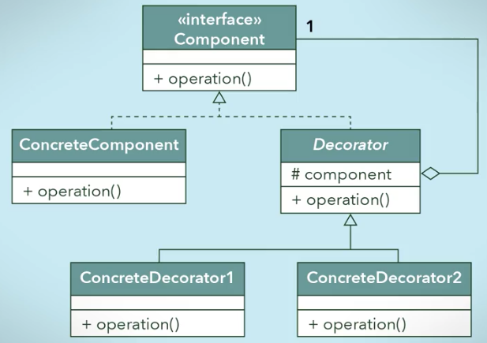
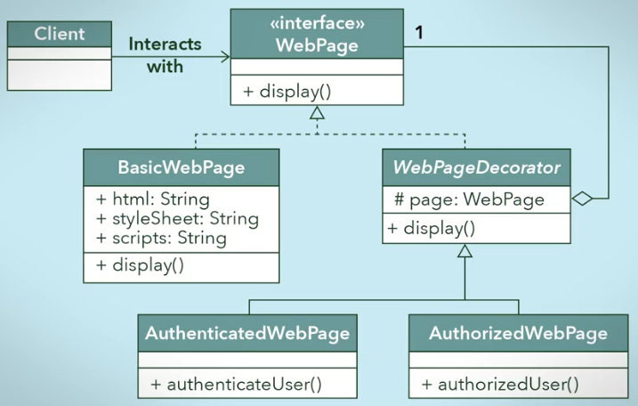

## Decorator Pattern

- Decorator aggregates other types of components which will allow us to **stack components** on top of each other, and **decorator serves as the abstract superclass of concrete decorator** classes that will provide an increment of behavior.

### What are the reasons for using the decorator design pattern?

- To reduce the number of classes needed to offer a combination of behaviors.
- The decorator design pattern allows objects to dynamically add behaviors to others.

### The main features of a decorate design pattern are:

- We can add, in effect, any number of behaviors dynamically to an object **at runtime** by using **aggregation as a substitute** for pure inheritance
- Polymorphism is achieved by implementing a single interface.
- Aggregation lets us create a stack of objects.
- Each decorator object in the stack is aggregated in a one-to-one relationship with the object below it in the stack. And,
- By combining aggregation and polymorphism, we can recursively invoke the same behavior down the stack and have the behavior execute upwards from the concrete component object.

### Generic Representation

### Example Another

### Stack

-  Here BasicWebPage is BASE DECORATOR CLASS
