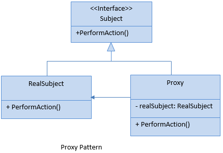
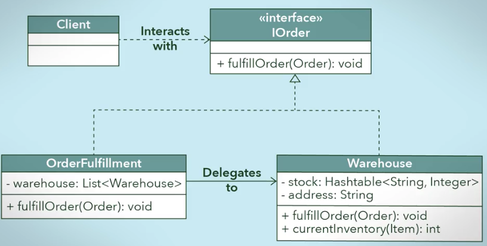

#### Subject
- This is an **interface** having members that will be implemented by RealSubject and Proxy class.

#### RealSubject
- This is a **class** which we want to use more efficiently by using proxy class.

#### Proxy
- This is a class which **holds the instance of RealSubject** class and can access RealSubject class members as required.

### When to use it?
- Objects need to be created on demand means when their operations are requested.

- **Access control** for the original object is required.

- Allow **accessing a remote object** by using a local object.

    

### Another Example

-    
- Note :  OrderFulfillment is a proxy class and Warehouse is real Subject class . OrderFulfillment validates whether item is in stock or not to fullfill the order .

### Which are key responsibilities of the proxy class?

- It protects the real subject class by checking the client's request and controlling access to the real subject class.
- It acts as a wrapper class for the real subject class.

### The main features of a proxy design pattern are:

- To use the proxy class to wrap the real subject class.
- To have a polymorphic design so that the client class can expect the same interface for the proxy and real subject classes.
- To use a lightweight proxy in place of a resource intensive object until it is actually needed.
- To implement some form of intelligent verification of requests from client code in order to determine if, how, and to whom the requests should be forwarded to.
- To present a local representation of a system that is not in the same physical or virtual space.