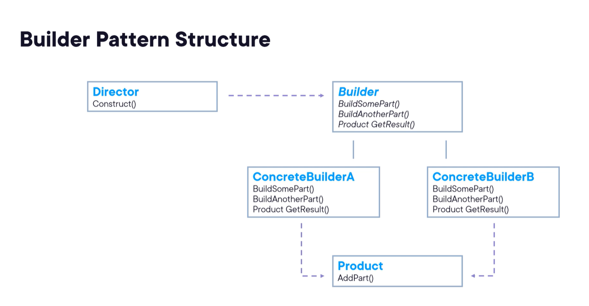

# Builder Pattern
### UseCases  
- Generating Documents
- Building a database query
- Creating a game character
- constructing a UI or Form 

### Cons
- Complexity of Code Increases
#### Example

#### Generic Representation

